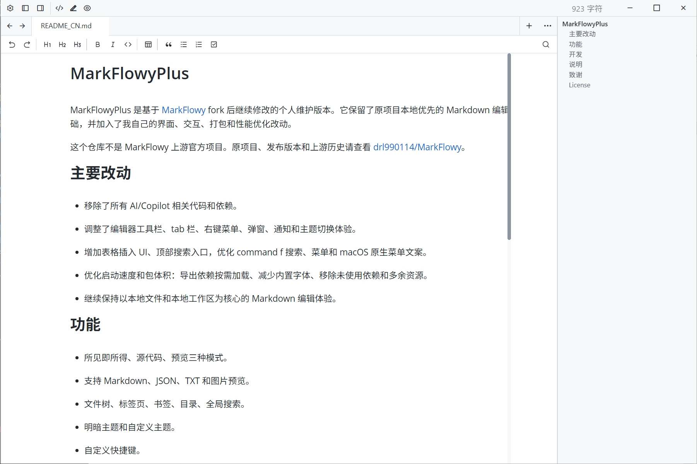

# MarkFlowyPlus

MarkFlowyPlus is a personal fork of [MarkFlowy](https://github.com/drl990114/MarkFlowy). It keeps the original local-first Markdown editor foundation and adds my own UI, interaction, packaging, and performance changes.

This repository is not the upstream MarkFlowy project. For the original project, releases, and upstream history, please visit [drl990114/MarkFlowy](https://github.com/drl990114/MarkFlowy).

## What Changed

- Removed all AI/Copilot related code and dependencies.
- Reworked parts of the editor toolbar, tab bar, context menus, dialogs, notifications, and theme behavior.
- Added table insertion UI, search toolbar entry, improved find/replace behavior, and several macOS menu/localization fixes.
- Optimized startup and package size by lazy-loading export dependencies, reducing bundled fonts, and trimming unused packages/assets.
- Keeps Markdown editing focused on local files and local workspace workflows.

## Features

- WYSIWYG, source code, and preview modes.
- Markdown, JSON, TXT, and image preview support.
- File tree, tabs, bookmarks, table of contents, and global search.
- Theme support with light/dark and custom themes.
- Custom keyboard shortcuts.
- Image paste/upload handling with local relative path options.
- macOS desktop packaging through Tauri.

## Development

```bash
yarn install
yarn workspace @markflowy/desktop tauri:dev
```

Build desktop frontend:

```bash
yarn workspace @markflowy/desktop build
```

Build macOS DMG:

```bash
scripts/package-dmg.sh
```

## Notes

This project is currently tailored for my own desktop usage and may diverge from upstream MarkFlowy. Some upstream features may be removed intentionally.

## Credits

This project is forked from [MarkFlowy](https://github.com/drl990114/MarkFlowy). Thanks to the original author and contributors for the foundation.

## License

This project follows the upstream license. See [LICENSE](./LICENSE).

## Preview




